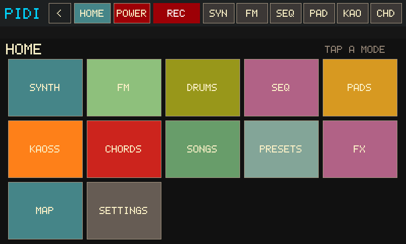

# Native jambox kiosk

Status: **active kiosk** (Python / Tk frozen on `cursor/python-kiosk-archive-dfc2`)

Rust-only appliance UI for the Pi TFT70. `jambox-engine` + `pidi-native` are the
runtime.

**Screen reference (native captures):** [docs/index.html](docs/index.html)




## Architecture

- `pidi-native` — SDL/KMSDRM + GLES2, mode shell, touch (prefer `--touch evdev`)
- `jambox-engine` — audio, MIDI, transport, clips, KAOSS, repeats
- On-disk phrases/presets/songs stay readable; adapters live in Rust

## Modes

| Mode | Status |
|---|---|
| KAOSS + drums | Full-width pad (Tk layout); axes/cursor; scale/key/oct/gate pickers, HOLD, FULL PAD, CELLS/GLOW, trail/ripples, WIPE FX, CH, OUT; Kaoss CC#12/13/92 when OUT is USB/BOTH. On-screen drums live on SEQ. |
| Nav shell / HOME | Top chrome (PiDI / HOME / POWER / jam tabs); Home 3×3 `HOME_TILES` |
| PADS | Launch/stop from `phrases/pad-XX.json`; PLAY/EDIT; REC/TRIG/MODE/CLEAR; SEQ→PAD; OUT cycle |
| SYNTH | Morph A/B wave pick, tone/level/atk/rel, vibrato, scope, kit macros, C4–B4 keys, **SAVE AS** (bake morph→`user-wavetables/` + `.fx.json`); Settings **FLANGE** insert on voice/bus |
| SEQ | Backbone REC → engine loop clip; KEEP/DROP/UNDO; len×2/÷2/EXTEND; →PAD; PLAY/STOP/CLEAR/BPM. Top-chrome **REC/STOP** arms recording from any mode. Armed REC also captures SYNTH keys, drums, CHORDS, KAOSS notes, and incoming MIDI. First take auto-trims leading/trailing dead air (Tk parity). |
| CHORDS | Omnichord-style circle-of-fifths buttons (MAJ/min/7 + combos), **strumplate**, 8-slot **palette**, **CHANGES** (named progressions in the chosen key), LOCAL/USB/BOTH. Block chords (buttons/palette) and harp strums record into SEQ / pad REC while those are armed. |
| SONGS | List `songs/*.mid`, SMF→clip PLAY/STOP/LOOP, SAVE SEQ, OUT cycle |
| PRESETS | 8 slots save/load synth params to `user-presets/` |
| MAP | Thru status; THRU ON / OFF / REFRESH PORTS → `midi-engine` (Linux appliance; Windows host explains Pi-only) |
| FX | BUS / VOICE / DRUMS target; DRIVE / DELAY / REVERB / **FLANGE** (bus = global wet; voice mirrors SYNTH FLANGE) |
| SETTINGS | Appliance hub: Panic, notes-off, **AUDIO**, **WIFI**, **UPDATE**, FONT, LOG, MAP |
| LOG | Engine counters + recent action lines |
| Session | Autosave `settings.json` (synth/kaoss/tempo/OUT prefs) |

## Appliance-oriented hooks

## User data (do not wipe)

All user-editable appliance content lives under one XDG-style root:

```text
${PIDI_DATA_ROOT:-${XDG_DATA_HOME:-$HOME/.local/share}/pidi}/
  settings.json
  songs/
  phrases/              # pad-01.json …
  user-presets/
  user-wavetables/      # SAVE AS + .fx.json
  .wifi-credentials
  takes/
```

Code, factory wavetables, and engines stay in `PIDI_REPO_ROOT` (the git tree).
SET→UPDATE must never touch the data root. Migrate an existing lab box with
`./deploy/migrate-user-data.sh`.

Map, WIFI, and UPDATE call host tools when present (`midi-engine`, `nmcli`,
`python3 apps/pidi/pidi/updater.py`). On a Windows host they report that those
actions belong on the Pi. Bin deploy remains `deploy/build-pi-bins.sh` /
`deploy/deploy.sh`.

## Remaining non-parity (vs Tk)

Map remap *editing* (learn/map JSON UI) is still thinner than full `midi-engine`
learn workflows — Map mode starts/stops thru and lists ports. Wavetable
hot-reload after SAVE AS refreshes the UI bank; the running engine picks up
new tables on next MorphPair / restart if indices drift.

## Run (host)

```bash
cargo test -p pidi-native -p jambox-protocol -p jambox-core
cargo run -p jambox-engine -- run --null-audio --tcp --control 127.0.0.1:17890
cargo run -p pidi-native -- --tcp --control 127.0.0.1:17890 --display dummy --frames 30
```

## Pi appliance

OTA: SET → UPDATE overlays `master`, then copies committed
`dist/armv7/{midi-engine,jambox-engine,pidi-native}` onto `bin/` and
restarts the units. After crate changes land on `master`, CI rebuilds
those ELFs and commits them (see `.github/workflows/build-pi-bins.yml`).

Manual cross-build (WSL Ubuntu 22.04 / Debian, or a cloud-agent VM):

```bash
PACKAGES=jambox-engine,pidi-native ./deploy/build-pi-bins.sh
```

Deploy bins to `~/pi-midi-toolkit/bin/`, then:

```bash
sudo systemctl stop lightdm
sudo systemctl mask lightdm   # keep KMSDRM free
sudo systemctl enable --now jambox-engine pidi-native
```

Unit defaults: `--display sdl --touch evdev`. Optional:

- `--evdev /dev/input/event4` if autodetect picks ADS7846
- `--phrases /path/to/phrases`
- `PIDI_PRESETS_DIR`, `PIDI_SONGS_DIR`, `JAMBOX_USER_WAVETABLES`

## Touch notes

Type-B `ABS_MT_*` only. Legacy `ABS_X`/`ABS_Y` ignored. Prefer FT5x06/Goodix
over ADS7846 when autodetecting.
