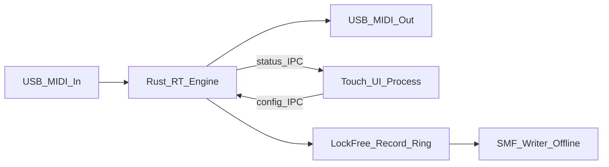
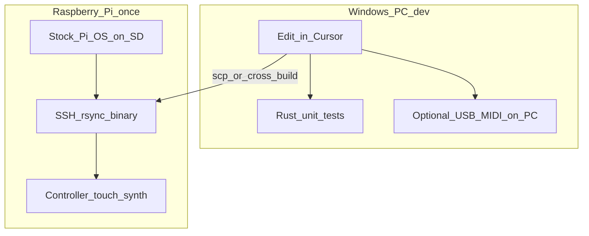

# Pi MIDI Toolkit

## Scope clarity

**This is not part of play-my-synth.** No shared repo, relay, WebRTC, or bridge code. That project is only a **feature wishlist reference** (CC remap, full velocity, channel remap, etc.). This is a standalone Pi appliance.

## Product north star (honest, dual purpose)

**One box, one kiosk UI — two equal jobs.**

| Pillar | Weight | What it is |
|--------|--------|------------|
| **Jambox / soft-synth** | **~50%** | A music box that matches *your* intuition: pads, morph, loops, phrase clips, songs — create and perform without learning another tracker/DAW |
| **MIDI remap appliance** | **~50%** | USB MIDI in → transform → USB/DIN out for hardware synths, when that path matters |

Power on → Openbox kiosk → modes. The soft-synth path started as a Phase 0 hear-test. **That framing is obsolete.** It is already a creative instrument: record a beat, play melody over it, sing, give someone a performance. If the box only did remap and never made a sound, half the reason to build it would be missing. If it only made local sound and never remapped, the other half would be missing.

**Design law for the jambox half:** prefer mental models you already use (hit pad → sound; record → loop; morph A→B; lock a voice) over dense menus. Hardware you already own (e.g. picotracker, EP-class grooveboxes) can be capable but costly in *learning time*. This project wins by staying obvious under your hands — not by cloning their feature lists.

| Mode (UI) | Pillar | Job |
|-----------|--------|-----|
| **Home** | Both | Tile launcher for every mode (top-bar HOME); jam shortcuts stay SYNTH/SEQ/PADS/KAOSS |
| **Synth** | Jambox | Wavetable morph synth + drum kit + scopes |
| **Seq** | Jambox | Free-timing backbone loop + 808-style overdub layers (drums and keys) |
| **Phrases / Pads** | Jambox (+ MIDI out) | 16 clip-launch cells; touch **and** MPK pads |
| **Kaoss** | Both | XY pad: scale notes + factory Kaoss CCs; LOCAL and/or USB→DIN |
| **Songs** | Both | `.mid` library; tempo; LOCAL and/or USB→DIN |
| **Presets** | Jambox | Synth slots + session autosave |
| **Map / Thru** | Remap | Channel / CC / velocity remap; ports; learn → Rust engine |
| **Log** | Both | Event history / commissioning |
| **Set** | Both | Opt-in GitHub update (CHECK `master` / UPDATE & restart) |

Boot path: `install-kiosk.sh` enables X11 + Desktop Autologin + **MIDI Tone Kiosk**
session (Openbox + fullscreen app). No normal Pi desktop shell. Undo with `disable-kiosk.sh`.

### Architecture rule (still true — and it helps the jambox)

- **Rust `midi-engine`:** MIDI **thru/remap** hot path only (ALSA in → transform → out). RT-friendly, no UI work.
- **Kiosk UI (`midi-tone` today):** the **jambox** — soft-synth, drums, sequencer, pads, songs, presets. Talks to the engine over IPC/files when Map mode is active.
- **UI never sits on the thru hot path.** Touching Map (or Synth) must not add jitter to live thru notes.
- Soft-synth audio is a first-class product path; it is *not* the remap thru path.
- **Songs / Pads → DIN** is a *player/emit* path (schedule MIDI out a USB port), not live thru. v1 may open MIDI out from the kiosk; later the engine can own the scheduler if we want RT priority / remap-on-playback.

Starting as a “diagnostic” did **not** trap the architecture. The split (Python/Tk jambox audio vs Rust thru) is exactly what lets the creative half grow without poisoning remap latency.

### Why both (updated)

- **Jambox:** the box is useful *tonight* — no DIN synth required. Beat + melody + voice is already a real outcome.
- **Remap:** when USB→DIN → hardware synth is on the desk, the same kiosk grows a Map mode; Rust stays the cable.
- Same power button, same UI shell, same deploy loop. Neither pillar is a temporary scaffold for the other.

## Opinion (short)

- **Thru/remap:** extremely low latency remains the hard constraint on the Rust path.
- **Jambox:** “good enough Pi 2 audio” that you will *actually play* beats the theoretically perfect synth you never finish learning. Push FX and feel until measurement says stop — then decide software vs hardware.
- Split architecture stays: **Rust** for thru; **one kiosk** for jambox + map config.

**Defaults:** standalone repo; kiosk-first UX; Rust + ALSA hot path for thru; UI never processes thru MIDI bytes; jambox features earn their CPU with a stress test, not vibes alone.

## Latency-first architecture

USB MIDI already costs ~0.5–1ms per hop. Target **&lt;1ms added processing**, low jitter, no flubs when the UI is touched.

| Layer | On MIDI hot path? |
|-------|-------------------|
| Remap channel / CC / velocity; drum retrigger ticks; phrase-loop emit; arp ticks | Yes |
| Push to preallocated lock-free record ring | Yes |
| JSON, disk, UI, allocations, blocking locks | **No** |

- **Engine (Rust):** ALSA → fixed processor chain → out. `SCHED_FIFO`, `mlockall`, zero alloc after start, atomic preset publish.
- **Kiosk UI (separate process):** jambox (Synth / Seq / Pads / Songs / …) + Map; config IPC to engine; local audio on the jambox path only.
- **Not used:** Python/Node on the *thru* path, Chromium, Electron, anything from play-my-synth.

## Feature map (what you asked for)

### Thru processors (cable + math)
- **Channel remap** — e.g. keys on ch1 → out ch3
- **CC remap** — knob `(inCh, ccN) → (outCh, ccM)` + Learn
- **Velocity** — always full 127; optional floor/ceiling or 128-entry curve table

### Generators / performers
These are different modes; don’t collapse them into one “arp”:

| Mode | What it does | How it differs |
|------|----------------|----------------|
| **Drum retrigger** | On pad hit (or hold), re-fire **that same note** on a **per-note interval** (e.g. kick every 100ms, hat every 50ms) until release or latch off | One note, fixed pitch, rate per pad — rolls/stutters, not a melody |
| **Sequencer (SEQ)** | **Record** what you play (absolute notes + timing), loop it, then **overdub layers** onto it | Captures your performance verbatim; loop length = the backbone take |
| **Arpeggiator** (key-relative) | You **author a relative step pattern** (intervals from a root); press a key → transpose pattern to that root and loop | Pattern is designed, not recorded; input key chooses transposition |

**Phrase loop vs arp:** same family (repeating notes in time), different input model.
- Sequencer = “record this lick, repeat it, then keep adding to it.”
- Arp = “here’s a pattern in scale degrees; play a root and I’ll spell it.”
You likely want **both** eventually; the **sequencer shipped first** (matches “record a note sequence and loop it”), and key-relative arp stays a later distinct mode.

Drum retrigger can share the engine’s RT timer infrastructure with the sequencer/arp, but it’s a separate processor (per-note rate table, not a multi-step sequence).

## Inspiration: CME UxMIDI / HxMIDI Tools

Public guide: [Start Guide for UxMIDI Tools and HxMIDI Tools](https://www.cme-pro.com/start-guide-for-uxmidi-tools-software-by-cme/).

CME’s PC/Mac app **configures their USB MIDI interfaces**. Filters, routes, and maps are stored **in the interface firmware**, so the box can run standalone without a computer.

**Our model is different (and fine for this appliance):** the **Raspberry Pi is always the brain**. A dumb USB-MIDI-DIN adapter is enough; presets/maps live on the Pi. The Pi already provides **USB host** (a major CME H-series selling point).

| CME feature | pi-midi-toolkit |
|-------------|-----------------|
| Channel remap | **Have** (`channel_map` in Rust presets) |
| CC remap + learn | **Have** (`cc_map` + `learn` CLI) |
| Velocity reshape | **Have** (full / clamp / curve) |
| Presets save/load/recall | **Have** as JSON on disk (Rust engine maps + midi-tone synth slots); kiosk Map UI next |
| MIDI filter (block ch / msg types) | **Natural next** on Rust hot path |
| Rich mapper (msg-type transform, invert, min/max, compress/expand, keep original, note transpose, multi-rule banks) | **Doable**; bigger than current remap — good Map-mode target |
| Thru / merge / multi-port matrix | **Partial:** 1→1 thru today; merge/split matrix = later multi-port work |
| USB host for controllers | **Pi already is a USB host** |
| Bluetooth MIDI | Optional later |
| Settings stored *in the cable*, works without a computer | **Out of scope** — our box *is* the computer |

**Near-term thru targets inspired by CME:** filters + richer mapper rules + Map mode in the kiosk.  
**Not chasing:** emulating “config lives in the adapter” or BLE unless needed.

## Inspiration: MIDIbox SEQ V4 Lite

Public page: [MIDIbox SEQ V4 Lite](https://www.ucapps.de/midibox_seq_lite.html) (Thorsten Klose, 2011 — firmware still maintained).

MBSEQV4L is a **MIDI sequence looper for live sessions**, not a tracker and not an audio synth. Two looping sequences, record from a keyboard (step *or* live), then spice the take with **MIDI-domain effects** chosen from 15 one-button presets per effect. The sequencer **never has to stop**: load/save, record, and FX changes stay in sync with the internal or incoming clock. No LCD, no encoders — dedicated buttons, prepared setups, immediate.

That UX law is closer to ours (“obvious under the hands, not another menu to learn”) than picotracker/EP cloning would be. The *effects* are the gap: our SEQ records and overdubs; SEQ Lite **performs the recording**.

**Already in our world (don’t treat as new work):**

| SEQ Lite | pi-midi-toolkit |
|----------|-----------------|
| Live record without stopping | **Have** — SEQ backbone + overdub |
| Overdub / extra notes on a running loop | **Have** — KEEP / DROP / UNDO layers (clearer than their track-clear) |
| Two parallel parts | **Partial** — one SEQ stack + 16 phrase pads; not two independent looping sequences with separate MIDI FX |
| Save / load patterns while running | **Partial** — Songs `.mid` + phrase JSON; not a measure-synced 64-slot live bank |
| MIDI thru (In→Out) | **Planned** — Map / Thru; not yet “thru *through* the sequencer’s scale/FX” |
| Poly recording | **Have** — we store what you play |
| Tempo | **Partial** — Songs BPM −/+; no tap tempo, no MIDI-clock master/slave |
| Copy / paste / undo | **Partial** — layer UNDO; no copy-seq-to-seq / copy-to-pad |
| Audio-style echo | **Have** — jambox delay/reverb (this is **not** MIDI echo) |
| Per-layer vibrato | **Have** — baked on SEQ/pad takes; related to their LFO but only pitch, not vel/length/CC, and not a live effect bus |

**Ideas we do *not* have in the plan today** (worth stealing as *ideas*, not as a feature-parity list):

### 1. MIDI effects on the running loop — the actual product of SEQ Lite

Our FX are **audio** (drive / delay / reverb) plus baked vibrato. SEQ Lite’s FX rewrite the **MIDI stream** of the loop. That is a different instrument:

| Effect | What it does | Why it isn’t “we have delay / arp / vibrato” |
|--------|----------------|-----------------------------------------------|
| **MIDI Echo** | Repeats notes after a delay; fades or boosts velocity; some presets also **nudge pitch of repeats**. On a mono synth this becomes rhythm, not a wash. Pairs with force-to-scale so pitch walks stay musical. | Audio delay smears the local synth. MIDI echo would also hit **USB→DIN**. Arp *authors* a pattern; echo *decorates* a recording. |
| **Groove styles** | Presets that vary **velocity, note delay, and note length** (swing / push / sloppy). | Quantize is listed as still-open for SEQ; groove is the musical *opposite* — keep the notes, change the feel. |
| **Humanizer** | Randomize note, velocity, length, CC. Aimed at velocity-switched / “natural” patches. | We have none. Cheap, and fits “sing over a loop that doesn’t sound mechanical.” |
| **LFO (Berlin-school button)** | Sine/saw spanning 16–64 steps, modulating **note, velocity, length, and/or CC**. One tap turns a static loop into a classic analog sequence. | Per-layer vibrato is a recorded pitch LFO on *that take’s* voices. This is a **live, retriggerable, sequence-wide** modulator, including CC. |
| **Step progression** | Play the same steps **backward / forward / repeat / skip**. Used to *stretch* a short take. Turning it off **re-syncs to the measure**. | LEN ×2/÷2 and WRAP/EXTEND change cycle math. Progression changes **read order** without rewriting the take — undoable performance, not a destructive edit. |

SEQ Lite does **not** expose delay-time / LFO-rate knobs. Each effect is **15 presets from “nice” to “extreme”** (plus off). That matches our design law better than a MIDI-FX parameter page.

**Fit:** optional later SEQ page: `GROOVE` / `ECHO` / `HUMAN` / `LFO` / `PROG` as preset rows, off-by-default, applied on emit (local synth *and* USB). Do not block current work (Rust audio cutover, Map mode, drum retrigger, arp).

### 2. Force-to-scale + live transpose of the *recording*

- **Scale + root** (Major, several minors, pentatonics, blues, modes, chromatic, whole-tone, octatonic…). Incoming and generated notes snap to it.
- **Transpose from the keyboard**: the running sequence follows the key you play; optionally the scale root follows too.
- Strongly recommended on SEQ Lite whenever note-mutating FX (echo pitch, LFO, humanizer) are on.

Phase 4 arp is **key-relative authored steps**. This is **transpose/quantize a recorded loop** (and live thru). CME “note transpose” on the remap path is related but chromatic, not scale-aware.

**Fit:** one Scale control (off / a few pentatonic+major/minor presets + root) plus “hold a key to transpose SEQ.” High leverage next to MIDI FX; small without them (just keeps live playing in key).

### 3. Step recording (punch a grid), not only free-timing

SEQ Lite’s “most important page”: pick a step, play a note/chord/CC; length is captured; re-selecting the step replaces the note. Live record is the other mode (notes + high-res CC). Poly vs **mono** (last note wins) is a toggle.

Our SEQ is **only** free-timing overdub. “Quantize” in Phase 3a is still open and is *playback* snap, not a 16-step enter-notes grid.

**Fit:** optional later. The 808 mental model we already shipped doesn’t need a piano roll. A coarse 16-step “tap cell → play note” overlay could sit beside REC without becoming a tracker — only if free-timing ever feels too sloppy for drums.

### 4. MIDI clock, tap tempo, bar-quantized start

SEQ Lite: internal clock (tap tempo ×5) **or** slave to MIDI/USB/OSC clock; auto-switch to slave when a clock arrives; **Start waits for the next 16-step bar** so you never come in between the measure; clock is always echoed out. Step divider (64th…whole, + triplets) re-syncs tracks to the measure.

We have Songs BPM and a sample-accurate *internal* clip clock. No MIDI-clock master/slave, no tap, no “start on next bar.”

**Fit:** matters the moment USB→DIN talks to a drum machine / hardware sequencer. Natural companion to Map / Songs / Pads OUT. Bar-quantized start matches phrase-pad `quantize: bar` we already have internally.

### 5. Smaller gaps (park, don’t pretend they’re planned)

| Idea | Notes |
|------|--------|
| **CC / pitchbend as sequence layers** | SEQ Lite records up to ~19 CC lines + PB at 64th resolution, muteable per track. Our `LoopEvent` is note on/off only. Record knobs into a take (or a pad) is a real later jam feature; not in the plan. |
| **Live pattern bank (measure-sync replace)** | 8 groups × 8 slots, load/save without stopping. We persist songs/phrases; we don’t hot-swap the running SEQ on a bar boundary from a bank. |
| **Two independent sequences** (Seq1/Seq2, own channel + FX, select both) | Pads cover “more than one loop.” Dual SEQ lanes with *separate MIDI FX* is the missing bit; easy to overbuild. Prefer MIDI FX on the one SEQ + pads first. |
| **Per-layer mute** | SEQ Lite mutes note / PB / CC tracks. Already listed as still-open for our SEQ. |
| **Loop point ≠ length** | Hold Length to set a loop start. We have WRAP/EXTEND + LEN ×2/÷2. |
| **MIDI thru through scale/FX** | SEQ Lite In→Out applies force-to-scale so a local-off synth is heard in-key. Map mode should stay a cable; “keyboard → scale → synth” can be a *jambox* option, not a thru-latency feature. |
| **Rec arm / per-layer record filter** | Record notes but not CCs. Only bites if we add CC layers. |

**Not chasing (hardware / product-identity):** 48-button / 64-LED front panel, SD-card session files compatible with full MBSEQ V4, DIN Sync / CV / AOUT, OSC Ethernet, using the Pi as a 16-track V4 playback brain, cloning their 64-step Bar1–4 editor, or turning SEQ into a tracker.

**If we steal one thing:** MIDI-FX presets on the running loop (groove + echo first; force-to-scale so echo/LFO stay musical). Everything else above is optional color once that feels good.

## Phase 0 — Jambox surface (`midi-tone`) — active, first-class

**Origin story:** prove **MPK → Pi** with a tiny soft synth (no DIN required).  
**Present tense:** this *is* half the product — the personal jambox.

Live surface in `tools/midi-tone`:
- Wavetable voices, A/B morph, MPK knobs, drum kit, scopes
- Modes: Synth / Seq / Pads / Kaoss / Songs / Presets / Log
- Kiosk session (`kiosk.sh` / Openbox) so the box boots into the UI
- **Session autosave** → `tools/midi-tone/settings.json` every ~2s when dirty and on quit
- **Named presets** → `tools/midi-tone/user-presets/slot-01.json` … `slot-08.json`
- **Songs** → `tools/midi-tone/songs/` with tempo + LOCAL/USB/BOTH out (Phase 3b)
- **Phrases** → `tools/midi-tone/phrases/pad-NN.json` (Phase 3c + pad-enhance)

This is **not** MIDI-out thru. It is the creative local instrument. Real use already includes recording a beat, playing synth melody over it, and performing for someone — that is the success bar for this pillar, not “notes appear in a log.”

### Phase 0b — Toy drum voices on MPK pads (soft-synth) — **done on `cursor/midi-tone-drum-voices-1052`**

**Was:** channel-10 pad hits were the same wavetable voices as piano keys.  
**Now:** Synsonics-style / analog drum-machine character — drums as **short synthesized hits**, not sustained pitched oscillators. Full **16-pad MPK kit** (Bank A 36–43 + Bank B 44–51).

| Piece | Approach |
|-------|----------|
| Trigger | MPK pads → MIDI ch10 (already `DRUM_CHANNEL`) |
| Models | **16 distinct procedural one-shots**: kick, snare, clap, hats, toms, rim, rimshot, shaker, cowbell, clave, ride, etc. Factory MPC notes 36–51 |
| vs keys | Keyboard channels keep wavetable morph synth; **only ch10** uses drum engine |
| Pitch | Per-hit base pitch + **pitch envelope** (how far/fast it drops) — the “tune” knob on a drum machine |
| Stretch / decay | Envelope times: body decay, noise decay; longer = flabbier / “stretched” hit (not time-stretch DSP) |
| Noise | Amount + color (LP/HP) for snare/hat; shared or per-model |
| Level / punch | Velocity → amplitude; optional click/transient gain |
| UI / knobs | Explicit **DRUM MODE** only → knobs 1–4 = pitch / drum-tone / stretch / noise; level always. Pad hits do not steal morph. Persist `drum_*` macros (not mode) in `settings.json` / presets |
| Not required | Sample ROMs, full GM drum kit, convolution. Keep Pi 2 cheap (a few envelopes + noise + 1–2 oscillators per voice) |

**Out of path:** Rust thru/remap does not synthesize audio. Phrases/Pads mode (3c) *launches MIDI clips* from pads — orthogonal; drum voices are “what a pad sounds like in Synth mode.”

### Wave visualizations — **done on `cursor/midi-tone-wave-viz-1052`**

| Scope | Where |
|-------|--------|
| **Morph cycle** | Always on SYNTH main — redraws with morph / voice changes (not a live mix oscilloscope) |
| **Drum one-shot** | **KIT** drill-down: pick a pad, preview wave updates with pitch/stretch/noise/tone. Keeps DRUM MODE chrome uncluttered |

**Inspiration note:** Synsonics = analog voice circuits per drum. We approximate that with simple DSP, not by modeling their schematic exactly.

## Jambox track — how far can we push? (and how we know)

The diagnostic framing did **not** paint a software dead-end. Limits will show up as **CPU, audio xruns, or latency feel** — measurable — not as “we called it Phase 0.”

### Effects (insert + kit group + bus) — **shipped in Python on `cursor/midi-tone-per-voice-fx-1052`**

Same cheap DSP chain (drive → delay → light reverb), different routing:

| Layer | UI | Routing |
|-------|----|---------|
| **Voice / drum insert** | **FX MODE** (+ KIT pad) | Per wavetable name, or one drum model. Melody wet does not smear a dry kit. |
| **Kit group** | **KIT → ALL DRUMS** while FX MODE | Shared bus on the whole drum sum (one echo for the kit). Keys stay dry. |
| **Master bus** | **BUS FX** | Optional wet after keys + drums are summed. |

Knob focus is mutually exclusive across FX MODE / BUS FX / DRUM MODE. Amounts persist as `voice_fx` / `drum_fx` / `drum_group_fx` / `bus_fx`.

| Effect | Status | Notes |
|--------|--------|-------|
| **Distortion / drive** | Done | Waveshape before delay |
| **Echo / delay** | Done | 50–750 ms, feedback + mix |
| **Reverb** | Done (light) | Short multi-tap recirculating tank — not a lush hall |

Play with these in the current `midi-tone` process **before** the Rust audio refactor so the feel is proven on hardware.

### Rust jambox engine — **scaffolded on `cursor/rust-jambox-engine-1052`**

Dropped beats while looping (UI/GIL/wall-clock sequencer vs audio callback) are a real product risk. Same law as thru:

> **UI is never on the audio / sequencer hot path.**

| Step | Intent | Status |
|------|--------|--------|
| **Ship FX in Python** | Jam and measure so the rewrite targets a known sound | Done |
| **`jambox-core`** | Wavetable + drums + FX + **sample-accurate** loop/phrase clock, no I/O | Done |
| **`jambox-engine`** | Audio thread, MIDI in/out, control socket, RT hints | Done |
| **UI cutover** | Tk becomes a thin client (mode switches, knobs, pad grid) over IPC | Client shipped; per-mode cutover next |

#### Timing model (why this fixes dropped beats)

The audio callback is the only clock. Clip events are stored in **ticks**, resolved to an **absolute frame** each block, and the block is **split at those frames** — a pad landing at frame 300 of a 512-frame buffer is heard at frame 300, not at the next boundary. Tests cover: exact frames under ragged block sizes, 32 loop cycles without drift, two pads launched apart still starting on the same bar, and a loop holding time while knob commands flood in every block.

#### Threading contract

| Thread | May do | Never does |
|--------|--------|------------|
| **Audio** | Arithmetic, ring pops, pointer swaps | Lock, allocate, free, log, syscall |
| **Control (IPC)** | JSON parsing, clip allocation **and freeing**, disk | Touch DSP state directly |
| **MIDI in** | Parse bytes → push command | Block on a full ring (drops instead) |
| **MIDI out** | Send bytes to the port | Run inside the audio callback |

Clips are built on the control thread, handed over as a `Box`, and the **old allocation is sent back** to be dropped off-thread — the callback only moves a pointer. Backpressure is reported to the UI (`command ring full`) rather than blocking anyone.

#### Measuring

`jambox-engine bench` renders a worst-case jam (held voices + drum loop + FX on every bus) offline and prints percent-of-one-core against the PLAN's <15% budget. No audio device required, so it runs in CI and over SSH on the Pi.

Remaining before the Python synth can retire: wavetable upload at runtime, preset/settings bridge, and moving each kiosk mode onto the client one at a time (Pads first — it has the most to gain).

### Stress test (the limit detector)

While playing hard (chords + rolling pads + looping phrase pads + FX on):

| Signal | Meaning |
|--------|---------|
| PortAudio / callback late, crackles | Audio path overloaded or buffers too small |
| One core pegged in `htop`, glitches scale with voices/FX | **CPU ceiling** — simplify DSP, cut polyphony, or accept the limit |
| CPU low but still glitches | Scheduling / buffer / Python callback design — often **software-fixable** |
| Feature needs much larger buffers to stay clean | You’re buying smoothness with **latency** — feel it before you keep it |
| Still hungry after DSP is tight and Pi 2 is pegged | **Hardware ceiling** — same app can move to Pi 4/5 later; architecture must not assume Pi 2 forever |

**Budget rule of thumb:** if a feature costs roughly **&lt;10–15% CPU** in a worst-case jam and doesn’t force painful buffer growth, it’s in budget. Document the measurement in the PR when landing FX.

### What we are *not* chasing on the jambox half

- Becoming Ableton / a tracker clone / a sample library host
- Feature parity with picotracker or EP-class boxes
- Convolution halls, unlimited polyphony, or plugin ecosystems on Pi 2

We *are* chasing: **obvious controls, reliable loops/pads, a sound you want to sing over.**

## Phase 1 — Remap MVP (engine CLI first; Map mode UI next)

Engine side is largely built: JSON presets + SSH/CLI. Prove channel/CC/velocity remap on real MIDI hardware when DIN synth is available.

1. Port select (ALSA by name) + commissioning CLI (`list` / `test` / `latency`)
2. Channel remap
3. CC remap + Learn
4. Always-full velocity (+ simple remap table)
5. Stuck-note / all-notes-off on preset change or disconnect
6. JSON presets on disk → publish into engine
7. **Next UX step:** add a **Map** mode to the same kiosk UI (edit preset / learn / start-stop thru) talking to `midi-engine` — not a second app the user has to launch

## Phase 2 — Drum retrigger

- Per MIDI note (pad): enable + interval (ms or musical division once clock exists)
- Trigger modes: **while held** vs **latch until next hit**
- Optional velocity of repeats (fixed / follow first hit / decay)
- Hot path: note-on arms a slot; RT timer re-sends note-on/off pairs; note-off or second hit clears

## Phase 3a — Sequencer / overdub looper (kiosk) — **done on `cursor/midi-tone-overdub-sequencer-1052`**

The free-timing looper grew into the **SEQ** mode and replaced it outright. One take on repeat is still one tap away (REC → play → REC), so nothing was lost; what's new is everything after that first take.

| Piece | Behavior |
|-------|----------|
| **Backbone** | First take. Auto-trimmed (`trim_loop_take`), and its length locks the cycle every later take is measured in |
| **Overdub** | REC while it loops. Drums *and* keys record. Hits become audible on the next pass, so you judge the layer in place |
| **KEEP / DROP** | KEEP flattens the take onto a layer stack; DROP abandons it. The backbone is never touched by a bad take |
| **UNDO** | Pops the newest kept layer. Layers stay separate on disk-free memory, so "flatten" doesn't mean "forget" |
| **Length** | `LEN ×2 / ÷2` in whole backbone cycles (max 8); short layers tile under long ones |
| **WRAP / EXTEND** | WRAP (default) folds a long take back onto the cycle, drum-machine style. EXTEND stretches the sequence to fit the take in whole cycles |
| **Per-layer vibrato** | Depth/rate/amount baked when a take closes; key notes from that layer get their own LFO on playback (drums never). Live rig changes don't rewrite older layers |
| **Export** | `SONGS → SAVE SEQ` writes the flattened sequence to `take-NNN.mid` |

Model and transport live in `tools/midi-tone/sequencer.py`, deliberately free of Tk / numpy / audio so the timing rules are unit-tested (`test_sequencer.py`) on any machine; `test_ui_seq.py` drives the real Tk screen under Xvfb with stub audio + MIDI ports.

Still open: quantize, per-layer mute, and moving the transport onto the Rust engine's sample-accurate clock (the layer model maps onto `jambox-core`'s clip sequencer — a layer is a clip with a span in cycles). MIDI-domain loop FX (groove / echo / humanizer / LFO / step progression), force-to-scale, and live transpose are **not** in this phase — see [Inspiration: MIDIbox SEQ V4 Lite](#inspiration-midibox-seq-v4-lite).

## Phase 3b — Songs / SMF player (cheap win; in progress)

**Why it’s basically free:** `mido` is already a dependency; Standard MIDI Files are tiny; tempo is just scaling event wait times. No DSP, no sampling, no new hardware beyond the USB→DIN adapter you already want for Map.

| Piece | Behavior |
|-------|----------|
| Library | All `*.mid` / `*.midi` in `tools/midi-tone/songs/` (gitignored) |
| Load (UI) | Chunky scrolling list + ▲ UP / ▼ DOWN; tap a row → **PLAY** |
| Save | Export current **SEQ** sequence (all layers flattened) → new `take-NNN.mid`; or drop any `.mid` into `songs/` |
| Demo pack | Bundled `demo-songs/` (~12 Mutopia classical MIDIs) ships with deploy; missing files seeded into `songs/` on launch. Optional `fetch_songs.py --all` when online. |
| Play | Schedule note/CC events to **local soft-synth** and/or **USB MIDI out → DIN** |
| Tempo | Touch BPM − / + (and show file’s native tempo); scales playback rate |
| Transport | Play / Stop / optional song-loop; All Notes Off on stop |
| Out target | `LOCAL` / `USB` / `BOTH` — pick DIN-ish output port by name when USB enabled |

Not a DAW: no piano roll, no multi-track edit. Just “keep songs, set tempo, send them out the DIN.”

**Engine note:** live remap thru stays in Rust. Song playback can start in the kiosk; if DIN playback needs RT scheduling or “play through the remap chain,” move the SMF clock into `midi-engine` and keep the UI as transport/library only.

## Phase 3c — Phrases / Pads (clip-launch grid) — **done on `cursor/midi-tone-phrase-pads-1052`**

Touch **4×4** grid (MPK Bank A + Bank B) where each cell holds a short recorded MIDI sequence. Launch a filled cell into the soft-synth — per-pad **ONE-SHOT** or **LOOP** (toggle). Empty cell → arm record into that cell. Persist under `tools/midi-tone/phrases/pad-NN.json`.

### Pad enhancements — **done on `cursor/midi-tone-pad-enhance-1052`**

| Feature | Behavior |
|---------|----------|
| **PLAY / EDIT views** | PLAY = launch grid + STOP ALL + OUT; EDIT = record/clear/mode + per-pad drill-down |
| **FOLLOW / LOCKED voice** | FOLLOW uses global morph + live master level; LOCKED bakes A/B+morph **and the master level** onto that pad (max 4 concurrent locked tables) |
| **Per-pad trim** | `VOL− / VOL+` scales that pad's velocities 10–200% so a locked voice can sit under the mix; FOLLOW resets it to 100% |
| **Per-pad vibrato** | Depth/rate/amount captured when the take stops; the synth renders that pad's voices with their own LFO. `VIB` toggles baked ↔ live |
| **Out channel** | Per pad: as-recorded or force ch1–16 on emit |
| **Local synth** | Per pad ON/OFF — OFF = MIDI-only (DIN/USB via session OUT) |
| **Pads OUT** | Session `LOCAL` / `USB` / `BOTH` (shares Songs USB outport) |

Persist per-pad fields in `phrases/pad-NN.json` (version 4 — adds per-pad `gain` and baked vibrato); session stores pads `view` + `out_mode` in `settings.json`.

### Launch inputs (both)

| Input | Behavior |
|-------|----------|
| **Touch square** | Tap cell on the kiosk grid to play / arm-record |
| **MPK mini drum pads** | Pad hit launches the mapped phrase cell (hardware performance path) |

**MPK mapping notes:**
- Pads arrive on **MIDI channel 10** (`DRUM_CHANNEL`).
- In **PADS mode**, ch10 note-ons **launch/arm phrase cells**, not drum voices. Synth mode still plays drum kit.
- Factory notes 36–51 → cells A1–A8 / B1–B8. Pad velocity ignored (fixed phrase dynamics) for now.
- Keyboard keys stay available for live play / recording into an armed cell.

| vs existing mode | Difference |
|------------------|------------|
| **Seq** | One free-timing sequence: backbone loop plus overdub layers |
| **Songs** | Whole `.mid` files + tempo transport |
| **Phrases / Pads** | Many one-shot / loop *phrases*; launch like an MPC / clip launcher from **screen or drum pads** |

**Related later (optional):** gated hold-to-stop; pad-velocity scaling; “Japanese game-ish” demo content = original/CC0 chip-style loops — not ripped game MIDIs.

### Pad enhancements — design notes (shipped on pad-enhance branch)

**MIDI out + local mute:** session OUT (`LOCAL`/`USB`/`BOTH`) gates routing; per-pad **CH** remaps emit channel (or as-recorded); **SYNTH** OFF skips soft-synth for that pad (DIN-only when USB/BOTH).

**PLAY vs EDIT:** same 16 cells; PLAY is performance (no arm-record); EDIT is record/clear/mode + TRIG / FOLLOW·LOCK / CH / SYNTH / OUT.

**Voice lock:** soft-synth multi-timbre — locked pads bake a wavetable; FOLLOW + live keys share global morph; drums stay procedural on ch10. Cap concurrent locked tables at 4 (Pi 2).

## Phase 3d — Kaoss XY pad — **done on `cursor/kaoss-pad-mode-0d80`**

The TFT70 is a 7″ capacitive surface; **KAOSS** is the mode that spends it. Two
Korg manuals set the rules (not a 100-program dump):

| Source | What we kept |
|--------|----------------|
| **Kaossilator KO-1** | X = scale-quantized pitch, Y = tone; lift = note-off; **HOLD**; **SCALE** + **KEY**; **GATE ARP** |
| **Kaoss Pad (factory MIDI)** | X = CC#12, Y = CC#13, pad touch = CC#92 (127/0) |

| Piece | Behavior |
|-------|----------|
| **PROG** | `LEAD` / `MORPH` / `VIB` play notes (Y = tone / morph / vibrato). `FILTER` / `ECHO` / `DRIVE` / `SPACE` are momentary mix-bus FX (restore on lift unless HOLD) |
| **PROG / SCALE / KEY / OCT / GATE** | Each opens a tap-to-pick grid. PROG: `LEAD` / `MORPH` / `VIB` play notes (Y = tone / morph / vibrato). `FILTER` / `ECHO` / `DRIVE` / `SPACE` are momentary mix-bus FX (restore on lift unless HOLD) |
| **⚙ settings** | SHOW ALL (factory Kaossilator PRO list + extra programs), X/Y axis labels on/off, OUT `LOCAL` / `USB` / `BOTH`, MIDI channel 1–16 |
| **SEQ** | Pad notes record into a running backbone / overdub take |
| **Look** | 12×7 LED field (create once, `itemconfigure` fills). Hue from X / program, finger glow + short trail, tap ripples, BPM rim pulse. Idle ~12 fps so a Pi 2 stays cheap |
| **FULL PAD** | Hide nav + settings so the pad fills 800×480. Exit is a 0.7s hold on a top rail |

Model: `tools/midi-tone/kaoss.py` (no Tk; color math is unit-tested). Tests: `test_kaoss.py`, `test_ui_kaoss.py`.

## Phase 4 — Key-relative arpeggiator

- Edit step sequence (intervals, gates, optional velocity steps)
- Held/latched root transposes and runs from engine clock
- Only after the sequencer / phrases exist so the product doesn’t overload one “sequence” concept

## Repo / stack

| Piece | Choice |
|-------|--------|
| MIDI engine | Rust, ALSA, RT thread |
| UI | One kiosk process (`midi-tone` today; grows Map mode). Not Chromium/Electron |
| IPC | Preset file watch now; later Unix socket or shm notify for Map ↔ engine |
| Deploy | `systemd`: `midi-engine` (RT, when thru needed) + kiosk session autostart |
| Day-to-day install | Stock Raspberry Pi OS + setup script — **not** a custom image every change |

## Development & testing (no SD reflash loop)

Flashing an image is **rare** (initial setup, or later a **finished install image** you can clone onto other SD cards). Daily work looks like web deploy-to-server, not “burn SD again.”

### What you do once
1. Flash **stock** Raspberry Pi OS (Imager) onto the SD card.
2. Enable SSH, join Wi‑Fi/Ethernet, note the Pi’s IP.
3. Run a **setup script** (packages, RT limits, systemd units, autologin/fullscreen UI).
4. Plug in controller / MIDI interface / synth / display (TFT70 when available).

### Daily loop (painful path avoided)
1. **Edit on your PC** in Cursor — same as any other repo.
2. **Test logic on the PC** without the Pi:
   - Pure Rust unit tests for remap, velocity tables, sequencer math, retrigger timing (fake clock).
   - Optional: run the engine on the PC with your USB MIDI devices (`midir` on Windows) to feel channel/CC/velocity; ALSA RT tuning is Linux-only, so this is functional, not final latency sign-off.
3. **Push to the Pi over the network** — **cross-compile on the PC or cloud-agent VM** (`./deploy/build-pi-bins.sh`) and **commit `dist/armv7/`** so SET→UPDATE can install the engines. SSH `deploy/deploy.sh` still scps `bin/` for LAN deploys. On-device `cargo build` is painfully slow on Pi 2.
4. **On-Pi checks** for what the PC can’t prove: ALSA port names, realtime scheduling, later touch UI / fullscreen.

Optional comfort: **Cursor/VS Code Remote SSH** into the Pi so the editor runs against the device; still no imaging.

### What we will *not* do day-to-day
- Rebuild a full OS image and re-burn the SD for each code change.
- Depend on QEMU Pi emulation for MIDI (USB MIDI passthrough is miserable; use it only if you ever need headless OS smoke tests).

### When a finished install image *might* show up later
Only when you want “flash SD → boots straight into the MIDI box” without SSH setup — e.g. cloning the same device for yourself or others. Until then, stock Pi OS + a setup script is enough. “Golden image” just means that frozen, ready-to-clone install; it is **not** part of the daily edit loop.

### Multi-unit / OTA (parked — only one unit today)

Not building this yet. Capture the ladder so we don’t overbuild or forget it when a second box (e.g. brother’s clone) appears.

**Reality check:** daily SSH push (`tools/midi-tone/deploy_pi.py`, `deploy/deploy.sh`) already *is* the update path for a LAN appliance. True “finds the Pi anywhere” OTA is a different product tier. The instrument can stay offline forever; network is only needed **when you choose to update**.

| Approach | When | Notes |
|----------|------|-------|
| **SSH push (now)** | 1 unit, home LAN | Keep. Highest leverage. |
| **Kiosk SET → UPDATE (now)** | 1 unit, when online | Opt-in from HOME → SET: CHECK `master`, deploy the whole repo (kiosk + crates + presets + committed `dist/armv7` engines into `bin/`), restart kiosk and engine units. Preserves user data. Needs a GitHub token because the repo is private. Does not cargo-build on the Pi — rebuild engines with `./deploy/build-pi-bins.sh` on the PC or cloud-agent VM **before commit**. |
| **Multi-host deploy list** | 2+ units on LAN | Same script, host list / `.pi-credentials` variants. Small change. |
| **Golden SD image** | Cloning a box for someone else | Flash once → boots kiosk. Best “gift a unit” path. Not the daily loop. |
| **Pull-on-boot / timer from Releases** | Hands-off updates when online | Tag release → Pi checks version → download tarball → swap app dir → restart kiosk. Preserve user data. |
| **Fleet OTA (Mender / RAUC / balena)** | Many units / field unattended | Overkill for 1–2 MIDI boxes. Skip until fleet exists. |

**If/when multi-unit lands, remember:**
- Per-device identity (hostname / `device-id`)
- Deploy must **never wipe** user content: `settings.json`, `songs/`, `phrases/`, `user-presets/`
- Optional version stamp in the UI so you know what’s running
- Updates are opt-in / occasional; offline play stays first-class

**High-leverage slice (shipped):** SET mode in the kiosk checks GitHub `master`, overlays the midi-tone tree without touching user data, and restarts. Host-list deploy + tagged Releases OTA can still wait until there is more than one unit. Full fleet OTA waits until there are more than two units.

## OS / hardware

**Compute (today):** Raspberry Pi 2 Model B v1.1. MIDI itself is tiny; the Pi 2 is enough **if we stay disciplined**. Architecture must not assume Pi 2 forever — if audio/FX/sequencer or DSI bring-up hits a wall, same software moves to Pi 4/5.

**Display (ordered → target):** [BigTreeTech Pi TFT70 V2.1](https://kb-3d.com/store/controllers-displays-drivers/2677-bigtreetech-pi-tft43-tft50-tft70-v21-touchscreen-panel-for-raspberry-pi-pi-2-1734017888380.html) — 7″ DSI panel, **800×480**, **5-point capacitive** (GT911). This replaces the current scrap/resistive HDMI+ADS7846 setup (dropped taps, outdated feel). Investing in the panel is intentional: the jambox is a real instrument surface, not a temporary diagnostic.

| | Current (desk) | Target (TFT70 V2.1) |
|--|----------------|---------------------|
| Size | ~5″ class | **7″** |
| Resolution | ~800×480-ish | **800×480** native (UI already ~800×420 + fullscreen) |
| Video | HDMI (GPIO LCD common) | **DSI** ribbon |
| Touch | Resistive **ADS7846** (SPI) — bouncey, needs calibrate | **Capacitive GT911** — multi-touch capable, no stylus scrape |
| Power | Panel-dependent | From Pi DSI (no separate PSU for panel) |

### Display / touch bring-up (when the TFT70 arrives)

1. **Physical:** DSI cable seated; Pi mounting holes on panel back if using short cable; keep USB MIDI + (optional) powered hub clear of the ribbon.
2. **OS:** Confirm Raspberry Pi OS sees DSI framebuffer + `GT911` (or equivalent) in `libinput list-devices` / `/proc/bus/input/devices`. Prefer **X11** kiosk path we already use (`raspi-config` → X11) until Wayland touch is proven.
3. **Touch path:** Stop requiring `enable-gpio-touch.sh` / `calibrate-touch-y.sh` (ADS7846-specific). Capacitance should need little/no libinput matrix; keep those scripts as **legacy** for the old panel only.
4. **UI:** Keep designing for **800×480 fullscreen**. 7″ at the same pixel grid means **larger physical hit targets** — good for music. Don’t invent a second layout; optional later: slightly larger fonts / pad cells if 7″ feels sparse.
5. **Tk touch code:** `_mk_touch_btn` currently debounces for ADS7846 bounce (press-only, 180 ms). On GT911, re-tune (likely shorter debounce; still press-to-fire, not click). Do **not** depend on multi-touch gestures for v1 — 5-point is a bonus, not a UX requirement.
6. **Pi 2 risk:** DSI+GT911 is widely used on Pi 3/4/BTT Pi; **verify on Pi 2 on day one**. If DSI/touch is flaky only on Pi 2, that becomes a hardware-upgrade trigger (same app → Pi 4/5), not a product rethink.
7. **Kiosk:** `kiosk.sh --fullscreen` should fill 800×480 with no letterboxing surprises; fix geometry default `800x420` → `800x480` when we cut over.

### First use case (concrete I/O)

Pi as **USB MIDI host** between controller and DIN gear:

- **In:** MPK mini mk3 plugged straight into the Pi (class-compliant; shows up as an ALSA/`midir` input — no Akai Windows driver on the Pi).
- **Out:** USB MIDI → DIN-5 cable/interface on a second USB port → synth.
- **Engine job:** open those two ports by name substring (e.g. `MPK` / `U2MIDI`), run remap chain, send.
- **Power note (Pi 2):** MPK + USB-DIN adapter are both bus-powered; if ports brown out or drop, use a **powered USB hub**. Pi 2 has enough port count (4× USB); power budget is the usual gotcha.
- Phase 1 preset example should document this pairing (channel force ch1→ch3, optional CC maps, full velocity) aimed at MPK quirks.

| Constraint | Rule |
|------------|------|
| CPU / 1GB RAM | Hot path in Rust only; no browser; defer or keep touch UI minimal |
| 32-bit `armv7` | Cross-compile from the PC; avoid on-device `cargo build` |
| No onboard Wi‑Fi | Ethernet (or USB Wi‑Fi) for SSH deploy |
| Latency | Optimize + measure on Pi 2; don’t assume Pi 4/5 numbers |
| Dual USB MIDI | Explicit in/out port selection; never assume a single combined device |

**Resource budget (design law):**
- Engine idle footprint small; no allocations on the MIDI thru path after start
- One kiosk UI process — never Chromium/Electron
- One job on screen per mode; no background dashboards or heavy frameworks
- CLI/JSON remain valid for headless commissioning even after Map UI exists

- Engine: `SCHED_FIFO` + `mlockall` via systemd where the kernel allows
- Pi 4/5 = optional later upgrade, not required to ship the appliance

## Success criteria

**Jambox pillar**
- Power on → kiosk; you can make a beat + melody performance without reading a manual
- Synth / drums / sequencer / pads feel playable on Pi 2 (fun under the hands, not just “notes work”)
- Record a phrase, loop it, launch pads, save/load `.mid` songs; LOCAL and/or USB→DIN when needed
- FX (when added) survive the stress test above without turning the box into a science project
- Stays obvious vs. gear you already own but don’t use because of learning cost
- Touch is reliable under performance (capacitive TFT70 target; no fighting resistive dropouts)

**Remap pillar**
- Map mode configures thru without a second app
- Remap feels like a direct cable under UI abuse
- Drum retrigger (when shipped) rolls without timing flubs

**Shared**
- Dev loop is SSH/deploy-based; imaging is exceptional
- No coupling to play-my-synth
- Neither pillar is treated as a temporary scaffold for the other

## Out of scope

- play-my-synth integration
- Browser / Electron UI
- Soft-synth **replacing** the hardware-synth thru path (jambox audio is first-class; it still is not the Rust mapper)
- Cloning tracker / EP / DAW workflows wholesale
- Custom kernel modules unless measurement forces it
- Requiring a new SD image for every iteration
