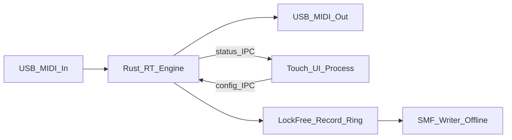
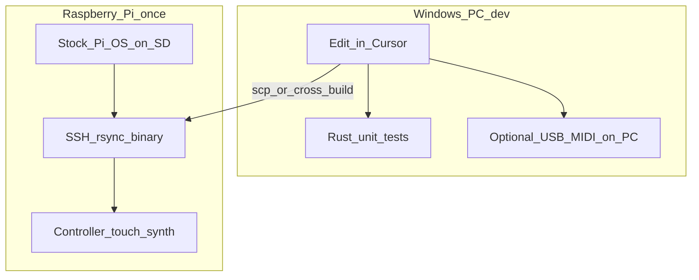

# Pi MIDI Toolkit

## Scope clarity

**This is not part of play-my-synth.** No shared repo, relay, WebRTC, or bridge code. That project is only a **feature wishlist reference** (CC remap, full velocity, channel remap, etc.). This is a standalone Pi appliance.

## Opinion (short)

Extremely low latency is the product constraint. Split architecture: **Rust MIDI engine** on a realtime path; **separate touch UI** for config only.

**Defaults:** new standalone repo; Phase 1 = remap tools; Rust + ALSA hot path; UI never sees MIDI bytes.

## Latency-first architecture

USB MIDI already costs ~0.5–1ms per hop. Target **&lt;1ms added processing**, low jitter, no flubs when the UI is touched.

| Layer | On MIDI hot path? |
|-------|-------------------|
| Remap channel / CC / velocity; drum retrigger ticks; phrase-loop emit; arp ticks | Yes |
| Push to preallocated lock-free record ring | Yes |
| JSON, disk, UI, allocations, blocking locks | **No** |

- **Engine (Rust):** ALSA → fixed processor chain → out. `SCHED_FIFO`, `mlockall`, zero alloc after start, atomic preset publish.
- **UI (separate process):** touch screens for ports/maps/modes; IPC only.
- **Not used:** Python/Node on the thru path, Chromium, Electron, anything from play-my-synth.

## Feature map (what you asked for)

### Thru processors (cable + math)
- **Channel remap** — e.g. keys on ch1 → out ch3
- **CC remap** — knob `(inCh, ccN) → (outCh, ccM)` + Learn
- **Velocity** — always full 127; optional floor/ceiling or 128-entry curve table

### Generators / performers
These are different modes; don’t collapse them into one “arp”:

| Mode | What it does | How it differs |
|------|----------------|----------------|
| **Drum retrigger** | On pad hit (or hold), re-fire **that same note** on a **per-note interval** (e.g. kick every 100ms, hat every 50ms) until release or latch off | One note, fixed pitch, rate per pad — rolls/stutters, not a melody |
| **Phrase looper** | **Record** what you play (absolute notes + timing), then **loop that clip** | Captures your performance verbatim; loop length = what you recorded |
| **Arpeggiator** (key-relative) | You **author a relative step pattern** (intervals from a root); press a key → transpose pattern to that root and loop | Pattern is designed, not recorded; input key chooses transposition |

**Phrase loop vs arp:** same family (repeating notes in time), different input model.
- Looper = “record this lick, repeat it.”
- Arp = “here’s a pattern in scale degrees; play a root and I’ll spell it.”
You likely want **both** eventually; ship **phrase looper first** (matches “record a note sequence and loop it”), keep key-relative arp as a later distinct mode.

Drum retrigger can share the engine’s RT timer infrastructure with looper/arp, but it’s a separate processor (per-note rate table, not a multi-step sequence).

## Phase 0 — Local MIDI hear-test (no DIN/synth required)

Before USB→DIN→hardware synth, prove **MPK → Pi** with a tiny diagnostic soft synth:

- Open MPK as MIDI input
- Note-on → sine at MIDI note frequency; note-off → silence
- Play through Pi headphone jack / HDMI audio
- Optional: dump raw events (`aseqdump`-style) for channel/CC checks

This is **not** MIDI-out; it’s audible confirmation the USB host path works. Keep it lean (Pi 2): one oscillator, no SoundFont/sampler stack.

## Phase 1 — Remap MVP (**no touchscreen required**)

Phase 1 is **headless / CLI-first**: engine + JSON presets + SSH. You prove channel/CC/velocity remap on real MIDI hardware before spending time on a touch UI. Touchscreen comes as a thin config UI **after** remaps feel solid (still Phase-1-adjacent, but not blocking the first useful binary).

1. Port select (ALSA by name) + commissioning CLI (`midi-list`, `midi-test`, latency check)
2. Channel remap
3. CC remap + Learn (Learn can be CLI/flag-driven until UI exists)
4. Always-full velocity (+ simple remap table)
5. Stuck-note / all-notes-off on preset change or disconnect
6. JSON presets on disk → publish into engine

## Phase 2 — Drum retrigger

- Per MIDI note (pad): enable + interval (ms or musical division once clock exists)
- Trigger modes: **while held** vs **latch until next hit**
- Optional velocity of repeats (fixed / follow first hit / decay)
- Hot path: note-on arms a slot; RT timer re-sends note-on/off pairs; note-off or second hit clears

## Phase 3 — Phrase record / loop (+ SMF)

- **Record:** post-transform events into lock-free ring (what the synth heard)
- **Loop:** promote buffer to a clip; RT scheduler repeats clip; overdub later if needed
- **Transport:** Record / Stop / Play loop / Clear — big touch targets
- **SMF:** export take or loop as `.mid` Type 0 offline (same capture path, file is a bonus)

## Phase 4 — Key-relative arpeggiator

- Edit step sequence (intervals, gates, optional velocity steps)
- Held/latched root transposes and runs from engine clock
- Only after looper exists so the product doesn’t overload one “sequence” concept

## Repo / stack

| Piece | Choice |
|-------|--------|
| MIDI engine | Rust, ALSA, RT thread |
| UI | Separate light touch process later (not Chromium); Phase 1 is CLI/JSON |
| IPC | Unix socket or shared-memory config + notify |
| Deploy | `systemd`: `midi-engine` (RT) + `midi-ui` |
| Day-to-day install | Stock Raspberry Pi OS + setup script — **not** a custom image every change |

## Development & testing (no SD reflash loop)

Flashing an image is **rare** (initial setup, or later a **finished install image** you can clone onto other SD cards). Daily work looks like web deploy-to-server, not “burn SD again.”

### What you do once
1. Flash **stock** Raspberry Pi OS (Imager) onto the SD card.
2. Enable SSH, join Wi‑Fi/Ethernet, note the Pi’s IP.
3. Run a **setup script** (packages, RT limits, systemd units, autologin/fullscreen UI).
4. Plug in controller / MIDI interface / synth / 5" display.

### Daily loop (painful path avoided)
1. **Edit on your PC** in Cursor — same as any other repo.
2. **Test logic on the PC** without the Pi:
   - Pure Rust unit tests for remap, velocity tables, looper math, retrigger timing (fake clock).
   - Optional: run the engine on the PC with your USB MIDI devices (`midir` on Windows) to feel channel/CC/velocity; ALSA RT tuning is Linux-only, so this is functional, not final latency sign-off.
3. **Push to the Pi over the network** — **cross-compile on the PC** strongly preferred on Pi 2 (`armv7-unknown-linux-gnueabihf`); on-device `cargo build` is painfully slow. `scp` the binary; restart `midi-engine` via SSH.
4. **On-Pi checks** for what the PC can’t prove: ALSA port names, realtime scheduling, later touch UI / fullscreen.

Optional comfort: **Cursor/VS Code Remote SSH** into the Pi so the editor runs against the device; still no imaging.

### What we will *not* do day-to-day
- Rebuild a full OS image and re-burn the SD for each code change.
- Depend on QEMU Pi emulation for MIDI (USB MIDI passthrough is miserable; use it only if you ever need headless OS smoke tests).

### When a finished install image *might* show up later
Only when you want “flash SD → boots straight into the MIDI box” without SSH setup — e.g. cloning the same device for yourself or others. Until then, stock Pi OS + a setup script is enough. “Golden image” just means that frozen, ready-to-clone install; it is **not** part of the daily edit loop.

## OS / hardware

**Current target: Raspberry Pi 2 Model B v1.1 + touchscreen already on the desk.** MIDI itself is tiny (1980s-era bandwidth); the Pi 2 is enough **if we stay disciplined**. If the board becomes a real ceiling later, move the same software to a Pi 4/5 — architecture should not assume Pi 2 forever, just run well on it now.

### First use case (concrete I/O)

Pi as **USB MIDI host** between controller and DIN gear:

- **In:** MPK mini mk3 plugged straight into the Pi (class-compliant; shows up as an ALSA/`midir` input — no Akai Windows driver on the Pi).
- **Out:** USB MIDI → DIN-5 cable/interface on a second USB port → synth.
- **Engine job:** open those two ports by name substring (e.g. `MPK` / `U2MIDI`), run remap chain, send.
- **Power note (Pi 2):** MPK + USB-DIN adapter are both bus-powered; if ports brown out or drop, use a **powered USB hub**. Pi 2 has enough port count (4× USB); power budget is the usual gotcha.
- Phase 1 preset example should document this pairing (channel force ch1→ch3, optional CC maps, full velocity) aimed at MPK quirks.

| Constraint | Rule |
|------------|------|
| CPU / 1GB RAM | Hot path in Rust only; no browser; defer or keep touch UI minimal |
| 32-bit `armv7` | Cross-compile from the PC; avoid on-device `cargo build` |
| No onboard Wi‑Fi | Ethernet (or USB Wi‑Fi) for SSH deploy |
| Latency | Optimize + measure on Pi 2; don’t assume Pi 4/5 numbers |
| Dual USB MIDI | Explicit in/out port selection; never assume a single combined device |

**Resource budget (design law):**
- Engine idle footprint small; no allocations on the MIDI path after start
- UI (when added) is a separate light process — never Chromium/Electron
- One job on screen; no background dashboards, telemetry, or heavy frameworks
- Prefer JSON + CLI for Phase 1 so the first useful box doesn’t pay for a GUI

- Engine: `SCHED_FIFO` + `mlockall` via systemd where the kernel allows
- Pi 4/5 = optional later upgrade, not required to ship Phase 1

## Success criteria

- Remap feels like a direct cable under UI abuse
- Drum pads can roll at set per-pad rates without timing flubs
- Record a phrase, loop it live, optionally save `.mid`
- Dev loop is SSH/deploy-based; imaging is exceptional
- No coupling to play-my-synth

## Out of scope

- play-my-synth integration
- Audio / soft synths
- Browser UI
- Custom kernel modules unless measurement forces it
- Requiring a new SD image for every iteration
