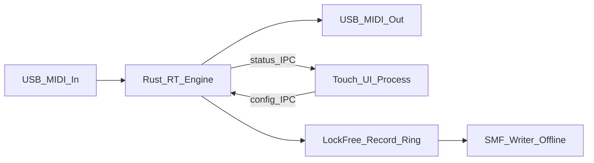
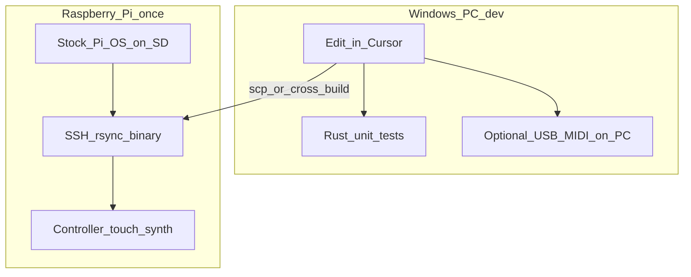

# Pi MIDI Toolkit

## Scope clarity

**This is not part of play-my-synth.** No shared repo, relay, WebRTC, or bridge code. That project is only a **feature wishlist reference** (CC remap, full velocity, channel remap, etc.). This is a standalone Pi appliance.

## Product north star (updated)

**One box, one kiosk UI.** Power on → Openbox kiosk → a MIDI-focused shell with modes. Playing notes is a first-class mode, not a temporary diagnostic you throw away.

| Mode (UI) | Job |
|-----------|-----|
| **Synth** | Local wavetable soft-synth (what `tools/midi-tone` is becoming) |
| **Looper** | Record/play free-timing MIDI note loops into that synth |
| **Songs** | Save/load Standard MIDI Files (`.mid`); tempo; play to soft-synth and/or **USB→DIN** |
| **Phrases / Pads** *(later)* | Grid of recorded MIDI phrases; launch from touch squares **and MPK mini drum pads** |
| **Presets** | Save/load synth settings (JSON slots); last session autosaved |
| **Map / Thru** | Channel / CC / velocity remap; ports; learn — drives the Rust engine |
| **Log** | Event history / commissioning |

Boot path: `install-kiosk.sh` + X11 Openbox session (already started). No normal Pi desktop shell.

### Architecture rule (still true)

- **Rust `midi-engine`:** MIDI **thru/remap** hot path only (ALSA in → transform → out). RT-friendly, no UI work.
- **Kiosk UI (Tk today, still a separate process from the engine):** config + local soft-synth + transport + **song file player**. Talks to the engine over IPC/files when Map mode is active.
- **UI never sits on the thru hot path.** Touching Map screens must not add jitter to live thru notes.
- Soft-synth audio is allowed in Synth/Looper/Songs (local preview); that path is *not* the remap thru path.
- **Songs → DIN** is a *player* path (schedule `.mid` events out a USB MIDI port), not live thru. v1 may open MIDI out from the kiosk; later the engine can own the scheduler if we want RT priority / remap-on-playback.

### Why both

You don’t have the hardware-synth DIN reason at home every day, but you still want the mapper eventually. The kiosk is the appliance; synth-toy mode keeps the box useful until USB-DIN → synth is plugged in. Same UI shell either way.

## Opinion (short)

Extremely low latency on **thru/remap** is still the hard constraint. Local soft-synth can be “good enough Pi 2 audio.” Split architecture: **Rust MIDI engine** on the realtime thru path; **one kiosk UI** for synth + map config.

**Defaults:** standalone repo; kiosk-first UX; Rust + ALSA hot path for thru; UI never processes thru MIDI bytes.

## Latency-first architecture

USB MIDI already costs ~0.5–1ms per hop. Target **&lt;1ms added processing**, low jitter, no flubs when the UI is touched.

| Layer | On MIDI hot path? |
|-------|-------------------|
| Remap channel / CC / velocity; drum retrigger ticks; phrase-loop emit; arp ticks | Yes |
| Push to preallocated lock-free record ring | Yes |
| JSON, disk, UI, allocations, blocking locks | **No** |

- **Engine (Rust):** ALSA → fixed processor chain → out. `SCHED_FIFO`, `mlockall`, zero alloc after start, atomic preset publish.
- **Kiosk UI (separate process):** Synth / Looper / Log / Map; config IPC to engine; local audio only in Synth/Looper.
- **Not used:** Python/Node on the *thru* path, Chromium, Electron, anything from play-my-synth.

## Feature map (what you asked for)

### Thru processors (cable + math)
- **Channel remap** — e.g. keys on ch1 → out ch3
- **CC remap** — knob `(inCh, ccN) → (outCh, ccM)` + Learn
- **Velocity** — always full 127; optional floor/ceiling or 128-entry curve table

### Generators / performers
These are different modes; don’t collapse them into one “arp”:

| Mode | What it does | How it differs |
|------|----------------|----------------|
| **Drum retrigger** | On pad hit (or hold), re-fire **that same note** on a **per-note interval** (e.g. kick every 100ms, hat every 50ms) until release or latch off | One note, fixed pitch, rate per pad — rolls/stutters, not a melody |
| **Phrase looper** | **Record** what you play (absolute notes + timing), then **loop that clip** | Captures your performance verbatim; loop length = what you recorded |
| **Arpeggiator** (key-relative) | You **author a relative step pattern** (intervals from a root); press a key → transpose pattern to that root and loop | Pattern is designed, not recorded; input key chooses transposition |

**Phrase loop vs arp:** same family (repeating notes in time), different input model.
- Looper = “record this lick, repeat it.”
- Arp = “here’s a pattern in scale degrees; play a root and I’ll spell it.”
You likely want **both** eventually; ship **phrase looper first** (matches “record a note sequence and loop it”), keep key-relative arp as a later distinct mode.

Drum retrigger can share the engine’s RT timer infrastructure with looper/arp, but it’s a separate processor (per-note rate table, not a multi-step sequence).

## Inspiration: CME UxMIDI / HxMIDI Tools

Public guide: [Start Guide for UxMIDI Tools and HxMIDI Tools](https://www.cme-pro.com/start-guide-for-uxmidi-tools-software-by-cme/).

CME’s PC/Mac app **configures their USB MIDI interfaces**. Filters, routes, and maps are stored **in the interface firmware**, so the box can run standalone without a computer.

**Our model is different (and fine for this appliance):** the **Raspberry Pi is always the brain**. A dumb USB-MIDI-DIN adapter is enough; presets/maps live on the Pi. The Pi already provides **USB host** (a major CME H-series selling point).

| CME feature | pi-midi-toolkit |
|-------------|-----------------|
| Channel remap | **Have** (`channel_map` in Rust presets) |
| CC remap + learn | **Have** (`cc_map` + `learn` CLI) |
| Velocity reshape | **Have** (full / clamp / curve) |
| Presets save/load/recall | **Have** as JSON on disk (Rust engine maps + midi-tone synth slots); kiosk Map UI next |
| MIDI filter (block ch / msg types) | **Natural next** on Rust hot path |
| Rich mapper (msg-type transform, invert, min/max, compress/expand, keep original, note transpose, multi-rule banks) | **Doable**; bigger than current remap — good Map-mode target |
| Thru / merge / multi-port matrix | **Partial:** 1→1 thru today; merge/split matrix = later multi-port work |
| USB host for controllers | **Pi already is a USB host** |
| Bluetooth MIDI | Optional later |
| Settings stored *in the cable*, works without a computer | **Out of scope** — our box *is* the computer |

**Near-term thru targets inspired by CME:** filters + richer mapper rules + Map mode in the kiosk.  
**Not chasing:** emulating “config lives in the adapter” or BLE unless needed.

## Phase 0 — Local MIDI hear-test → Synth mode (active)

Started as: prove **MPK → Pi** with a tiny soft synth (no DIN required).

**Became the live product surface** in `tools/midi-tone`:
- Wavetable voices, A/B morph, MPK knobs, modes (Synth / Looper / Songs / Presets / Log)
- Kiosk session (`kiosk.sh` / Openbox) so the box boots into the UI
- **Session autosave** → `tools/midi-tone/settings.json` (full velocity, voice, morph A/B, tone/level/attack/release/vib, etc.) every ~2s when dirty and on quit
- **Named presets** → `tools/midi-tone/user-presets/slot-01.json` … `slot-08.json` (SAVE / LOAD / DELETE in PRESETS mode)
- **Songs** → `tools/midi-tone/songs/song-XX.mid` with tempo + LOCAL/USB/BOTH out (see Phase 3b)

This is still **not** MIDI-out thru. It’s the playable local mode of the appliance.

### Phase 0b — Toy drum voices on MPK pads (later; soft-synth only)

**Today:** channel-10 pad hits are the same wavetable voices as piano keys (only a bit louder / retrigger-friendly). That’s why pads feel like “notes,” not drums.

**Wanted:** Synsonics-style / analog drum-machine character — drums as **short synthesized hits**, not sustained pitched oscillators. Real gear (Synsonics, TR-style, etc.) is usually pitched decay + noise + envelopes, not samples.

| Piece | Approach |
|-------|----------|
| Trigger | MPK pads → MIDI ch10 (already `DRUM_CHANNEL`) |
| Models | Small set of **procedural** voices: kick (sine + pitch drop), tom (similar, higher), snare (tone + noise), hat/cymbal (filtered noise). Map GM-ish pad notes → model |
| vs keys | Keyboard channels keep wavetable morph synth; **only ch10** uses drum engine |
| Pitch | Per-hit base pitch + **pitch envelope** (how far/fast it drops) — the “tune” knob on a drum machine |
| Stretch / decay | Envelope times: body decay, noise decay; longer = flabbier / “stretched” hit (not time-stretch DSP) |
| Noise | Amount + color (LP/HP) for snare/hat; shared or per-model |
| Level / punch | Velocity → amplitude; optional click/transient gain |
| UI / knobs | When last event was a pad (or a DRUMS submode): reuse MPK knobs for **pitch, decay/stretch, noise, tone** instead of (or layered under) key-synth morph. Persist in `settings.json` |
| Not required | Sample ROMs, full GM drum kit, convolution. Keep Pi 2 cheap (a few envelopes + noise + 1–2 oscillators per voice) |

**Out of path:** Rust thru/remap does not synthesize audio. Phrases/Pads mode (3c) *launches MIDI clips* from pads — orthogonal; drum voices are “what a pad sounds like in Synth mode.”

**Inspiration note:** Synsonics = analog voice circuits per drum. We approximate that with simple DSP, not by modeling their schematic exactly.

## Phase 1 — Remap MVP (engine CLI first; Map mode UI next)

Engine side is largely built: JSON presets + SSH/CLI. Prove channel/CC/velocity remap on real MIDI hardware when DIN synth is available.

1. Port select (ALSA by name) + commissioning CLI (`list` / `test` / `latency`)
2. Channel remap
3. CC remap + Learn
4. Always-full velocity (+ simple remap table)
5. Stuck-note / all-notes-off on preset change or disconnect
6. JSON presets on disk → publish into engine
7. **Next UX step:** add a **Map** mode to the same kiosk UI (edit preset / learn / start-stop thru) talking to `midi-engine` — not a second app the user has to launch

## Phase 2 — Drum retrigger

- Per MIDI note (pad): enable + interval (ms or musical division once clock exists)
- Trigger modes: **while held** vs **latch until next hit**
- Optional velocity of repeats (fixed / follow first hit / decay)
- Hot path: note-on arms a slot; RT timer re-sends note-on/off pairs; note-off or second hit clears

## Phase 3a — Live phrase looper (kiosk; started)

In `midi-tone` today: free-timing note record → loop into the soft-synth. Later: overdub, quantize, optional feed into thru/Songs.

## Phase 3b — Songs / SMF player (cheap win; in progress)

**Why it’s basically free:** `mido` is already a dependency; Standard MIDI Files are tiny; tempo is just scaling event wait times. No DSP, no sampling, no new hardware beyond the USB→DIN adapter you already want for Map.

| Piece | Behavior |
|-------|----------|
| Library | All `*.mid` / `*.midi` in `tools/midi-tone/songs/` (gitignored) |
| Load (UI) | Chunky scrolling list + ▲ UP / ▼ DOWN; tap a row → **PLAY** |
| Save | Export current **Looper** take → new `take-NNN.mid`; or drop any `.mid` into `songs/` |
| Demo pack | Bundled `demo-songs/` (~12 Mutopia classical MIDIs) ships with deploy; missing files seeded into `songs/` on launch. Optional `fetch_songs.py --all` when online. |
| Play | Schedule note/CC events to **local soft-synth** and/or **USB MIDI out → DIN** |
| Tempo | Touch BPM − / + (and show file’s native tempo); scales playback rate |
| Transport | Play / Stop / optional song-loop; All Notes Off on stop |
| Out target | `LOCAL` / `USB` / `BOTH` — pick DIN-ish output port by name when USB enabled |

Not a DAW: no piano roll, no multi-track edit. Just “keep songs, set tempo, send them out the DIN.”

**Engine note:** live remap thru stays in Rust. Song playback can start in the kiosk; if DIN playback needs RT scheduling or “play through the remap chain,” move the SMF clock into `midi-engine` and keep the UI as transport/library only.

## Phase 3c — Phrases / Pads (clip-launch grid; later)

**Idea (parked):** a touch grid (e.g. 4×4 or 2×4 to match the MPK) where each cell holds a short recorded MIDI sequence. Launch a filled cell into the soft-synth and/or USB→DIN. Empty cell → arm record into that cell. Optional hold-to-stop / clear.

### Launch inputs (both required)

| Input | Behavior |
|-------|----------|
| **Touch square** | Tap cell on the kiosk grid to play / arm-record |
| **MPK mini drum pads** | Pad hit launches the mapped phrase cell (hardware performance path) |

**MPK mapping notes:**
- Pads arrive on **MIDI channel 10** (already special-cased as `DRUM_CHANNEL` in midi-tone).
- In **Phrases mode**, ch10 note-ons should **launch phrase cells**, not play the soft-synth drum hit (or make that a toggle: *pads → phrases* vs *pads → drums*).
- Default: pad bank order → cell 1…N (document factory MPK note numbers; allow remap later).
- Velocity of the pad hit can scale phrase velocity or be ignored (fixed phrase dynamics) — pick a simple default first.
- Keyboard keys stay available for live play / recording into an armed cell.

| vs existing mode | Difference |
|------------------|------------|
| **Looper** | One free-timing loop on repeat |
| **Songs** | Whole `.mid` files + tempo transport |
| **Phrases / Pads** | Many one-shot (or gated) *phrases*; launch like an MPC / clip launcher from **screen or drum pads** |

**Why it fits this box:** huge touch targets *and* the MPK pads you already have in hand; works when you’re not looking at the screen. Content is *your* takes. Same capture buffer family as LOOPER; different launcher UI. Persist cells as small `.mid` or JSON event lists under e.g. `tools/midi-tone/phrases/`.

**Not now:** ship after Songs feels solid. Don’t block Map/thru on this.

**Related later (optional, not scheduled):** “Japanese game-ish” demo content = original/CC0 chip-style loops or just play existing phrases through chip-ish wavetables — not ripped game MIDIs.

## Phase 4 — Key-relative arpeggiator

- Edit step sequence (intervals, gates, optional velocity steps)
- Held/latched root transposes and runs from engine clock
- Only after looper / phrases exist so the product doesn’t overload one “sequence” concept

## Repo / stack

| Piece | Choice |
|-------|--------|
| MIDI engine | Rust, ALSA, RT thread |
| UI | One kiosk process (`midi-tone` today; grows Map mode). Not Chromium/Electron |
| IPC | Preset file watch now; later Unix socket or shm notify for Map ↔ engine |
| Deploy | `systemd`: `midi-engine` (RT, when thru needed) + kiosk session autostart |
| Day-to-day install | Stock Raspberry Pi OS + setup script — **not** a custom image every change |

## Development & testing (no SD reflash loop)

Flashing an image is **rare** (initial setup, or later a **finished install image** you can clone onto other SD cards). Daily work looks like web deploy-to-server, not “burn SD again.”

### What you do once
1. Flash **stock** Raspberry Pi OS (Imager) onto the SD card.
2. Enable SSH, join Wi‑Fi/Ethernet, note the Pi’s IP.
3. Run a **setup script** (packages, RT limits, systemd units, autologin/fullscreen UI).
4. Plug in controller / MIDI interface / synth / 5" display.

### Daily loop (painful path avoided)
1. **Edit on your PC** in Cursor — same as any other repo.
2. **Test logic on the PC** without the Pi:
   - Pure Rust unit tests for remap, velocity tables, looper math, retrigger timing (fake clock).
   - Optional: run the engine on the PC with your USB MIDI devices (`midir` on Windows) to feel channel/CC/velocity; ALSA RT tuning is Linux-only, so this is functional, not final latency sign-off.
3. **Push to the Pi over the network** — **cross-compile on the PC** strongly preferred on Pi 2 (`armv7-unknown-linux-gnueabihf`); on-device `cargo build` is painfully slow. `scp` the binary; restart `midi-engine` via SSH.
4. **On-Pi checks** for what the PC can’t prove: ALSA port names, realtime scheduling, later touch UI / fullscreen.

Optional comfort: **Cursor/VS Code Remote SSH** into the Pi so the editor runs against the device; still no imaging.

### What we will *not* do day-to-day
- Rebuild a full OS image and re-burn the SD for each code change.
- Depend on QEMU Pi emulation for MIDI (USB MIDI passthrough is miserable; use it only if you ever need headless OS smoke tests).

### When a finished install image *might* show up later
Only when you want “flash SD → boots straight into the MIDI box” without SSH setup — e.g. cloning the same device for yourself or others. Until then, stock Pi OS + a setup script is enough. “Golden image” just means that frozen, ready-to-clone install; it is **not** part of the daily edit loop.

## OS / hardware

**Current target: Raspberry Pi 2 Model B v1.1 + touchscreen already on the desk.** MIDI itself is tiny (1980s-era bandwidth); the Pi 2 is enough **if we stay disciplined**. If the board becomes a real ceiling later, move the same software to a Pi 4/5 — architecture should not assume Pi 2 forever, just run well on it now.

### First use case (concrete I/O)

Pi as **USB MIDI host** between controller and DIN gear:

- **In:** MPK mini mk3 plugged straight into the Pi (class-compliant; shows up as an ALSA/`midir` input — no Akai Windows driver on the Pi).
- **Out:** USB MIDI → DIN-5 cable/interface on a second USB port → synth.
- **Engine job:** open those two ports by name substring (e.g. `MPK` / `U2MIDI`), run remap chain, send.
- **Power note (Pi 2):** MPK + USB-DIN adapter are both bus-powered; if ports brown out or drop, use a **powered USB hub**. Pi 2 has enough port count (4× USB); power budget is the usual gotcha.
- Phase 1 preset example should document this pairing (channel force ch1→ch3, optional CC maps, full velocity) aimed at MPK quirks.

| Constraint | Rule |
|------------|------|
| CPU / 1GB RAM | Hot path in Rust only; no browser; defer or keep touch UI minimal |
| 32-bit `armv7` | Cross-compile from the PC; avoid on-device `cargo build` |
| No onboard Wi‑Fi | Ethernet (or USB Wi‑Fi) for SSH deploy |
| Latency | Optimize + measure on Pi 2; don’t assume Pi 4/5 numbers |
| Dual USB MIDI | Explicit in/out port selection; never assume a single combined device |

**Resource budget (design law):**
- Engine idle footprint small; no allocations on the MIDI thru path after start
- One kiosk UI process — never Chromium/Electron
- One job on screen per mode; no background dashboards or heavy frameworks
- CLI/JSON remain valid for headless commissioning even after Map UI exists

- Engine: `SCHED_FIFO` + `mlockall` via systemd where the kernel allows
- Pi 4/5 = optional later upgrade, not required to ship the appliance

## Success criteria

- Power on → kiosk MIDI UI, no desktop shell
- Synth mode is fun/usable on Pi 2; Map mode configures thru without a second app
- Remap feels like a direct cable under UI abuse
- Drum pads can roll at set per-pad rates without timing flubs
- Record a phrase, loop it live, save/load `.mid` songs with tempo, play to soft-synth or USB→DIN
- Later: launch multiple recorded phrases from a touch grid **and MPK drum pads** (Phase 3c)
- Dev loop is SSH/deploy-based; imaging is exceptional
- No coupling to play-my-synth

## Out of scope

- play-my-synth integration
- Browser / Electron UI
- Soft-synth replacing the hardware-synth thru path (local audio is a *mode*, not the mapper)
- Custom kernel modules unless measurement forces it
- Requiring a new SD image for every iteration
